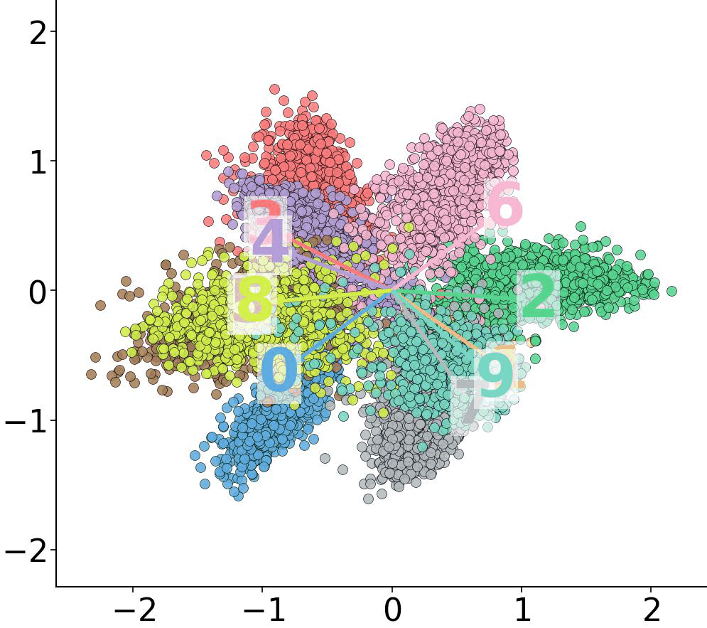
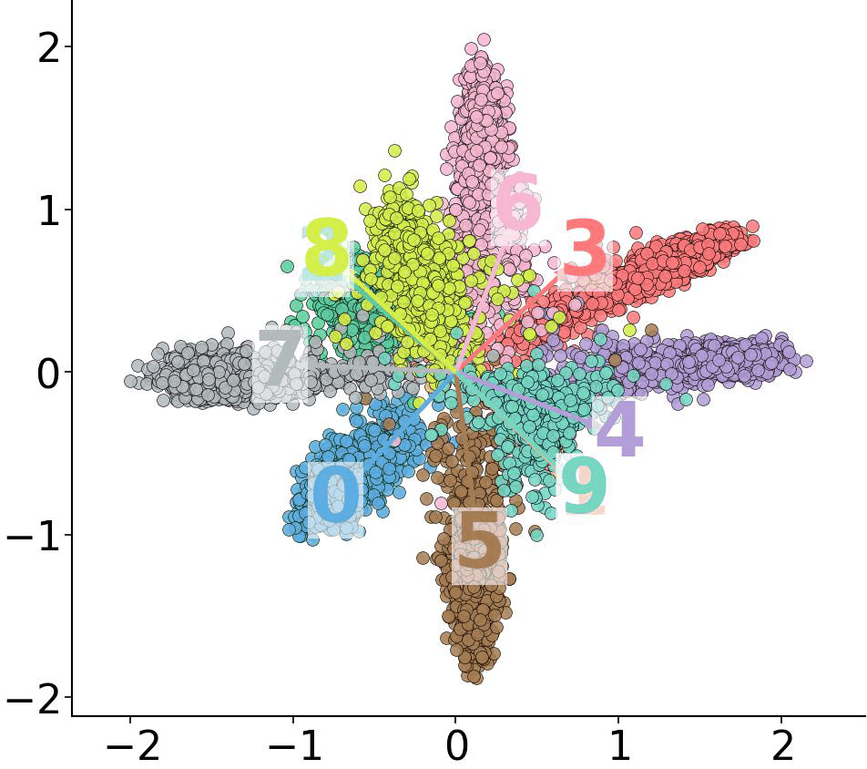

# Rethinking $\boldsymbol{\ell}_{2}$ Normalization: Preventing Norm Inflation in Face Recognition

This website contains the source code of $\boldsymbol{\ell}_{2}$ Detached Normalization ($\boldsymbol{\ell}_{2}\mathrm{DN}$), which is proposed in the paper: **Rethinking $\boldsymbol{\ell}_{2}$ Normalization: Preventing Norm Inflation in Face Recognition**. $\boldsymbol{\ell}_{2}\mathrm{DN}$ is a replacement of $\boldsymbol{\ell}_{2}$ Normalization ($\boldsymbol{\ell}_{2}\mathrm{D}$) for constraining the consistent norm growth of class-centers (also called proxies, or prototypes) and features during training, as a huge magnitude of norms hinders the model convergence. The effect of $\boldsymbol{\ell}_{2}\mathrm{DN}$ is shown in the following figures, demonstrating that the class-center and feature norms under $\boldsymbol{\ell}_{2}\mathrm{N}$ diverge, where as those under $\boldsymbol{\ell}_{2}\mathrm{DN}$ remain much more compact. In experiments, $\boldsymbol{\ell}_{2}\mathrm{DN}$ achieves the best average accuracy under various dataset+model settings at 20 epochs, while suffering less than a 1% performance drops when training is reduced to only 5 epochs.

<div style="display:flex; gap:16px; align-items:flex-start; flex-wrap:wrap;">
  <figure style="margin:0; text-align:center;">
    
    <figcaption>Figure 1：Feature space under L2N</figcaption>
  </figure>

  <figure style="margin:0; text-align:center;">
    
    <figcaption>Figure 2：Feature space under L2DN</figcaption>
  </figure>
</div>

## Acknowledgement

The code of $\boldsymbol{\ell}_{2}\mathrm{DN}$ is modified and developed based on arcface_pytorch<sup>1</sup> in InsightFace<sup>2</sup>.

<div id="arcface_repository"></div>

[1] Arcface_repository: <https://github.com/deepinsight/insightface/tree/master/recognition/arcface_torch>, accessed 4/Dec/2025.

<div id="insightface_paper"></div>

[2] Jia Guo, Jiankang Deng, Xiang An, Jack Yu, and Baris Gecer, InsightFace: <https://github.com/deepinsight/insightface>, accessed 4/Dec/2025.

## Requirements

- NVidia Geforce RTX 4090.
    - We also tried to run on NVidia Geforce RTX 3090, which is a little slower yet feasible for large-scale face recognition training
    - We also tried to run on NVidia Tesla A800, which is a little faster yet no big difference
    - To the best of our knowledge, 3090 is not the very basic requirement. Although we did not try it yet, we can confidently claim that training ResNet100 on MS1MV3 in 1 day with even lower level GPU must be possible.
- The operating system could be either Windows, or Linux (Ubuntu and CentOS).
- (Optional) Install [Anaconda](https://www.anaconda.com/download), we employ Anaconda to manage the developing environment.
- Install [PyTorch](https://pytorch.org/get-started/locally/).
- Install the depending packages using the command: `pip install -r requirement.txt`.

## Datasets

- Arface_pytorch needs to install MXNet in order to read datasets from ".rec" files. The way to install the environment is in the document [`./utils/INSTALL_MXNET.md`](./utils/INSTALL_MXNET.md). However, it needs hours or even days to configure the developing environment. Thus, for simplicity and reproducibility, we converted the ".rec" files into ".jpg" images, though the huge amount of images will lead to that too many small files on the hard disk. In addition, the dataset WebFace42M contains ".jpg" images instead of ".rec" files, and thus we select ".jpg" images as our training data.
- [MS1MV2](https://github.com/deepinsight/insightface/tree/master/recognition/_datasets_#ms1m-arcface-85k-ids58m-images-57) (87k IDs, 5.8M images)
  - Need to convert from ".rec" files to ".jpg" images. We put our converting file in `./utils/rec2img.py`. Yet, it requires installing MXNet to read ".rec" files and we believe it will take some time for the deployment. The way to install MXNet is in the document [`./utils/INSTALL_MXNET.md`](./utils/INSTALL_MXNET.md)
- [MS1MV3](https://github.com/deepinsight/insightface/tree/master/recognition/_datasets_#ms1m-retinaface) (93k IDs, 5.2M images)
    - Need to convert from ".rec" files to ".jpg" images. We put our converting file in `./utils/rec2img.py`. Yet, it requires installing MXNet to read ".rec" files and we believe it will take some time for the deployment. The way to install MXNet is in the document [`./utils/INSTALL_MXNET.md`](./utils/INSTALL_MXNET.md)
    - To the best of our knowledge, MS1MV3 is a good training dataset if lacking of enough hardware resources, since comparing to WebFace42M, it has relatively less images while a satisfied accuracy of trained models.
- [WebFace42M](https://www.face-benchmark.org/download.html) (2M IDs, 42.5M images)
    - Need to sign a form and send an email asking for the download link.
    - We sampled 10% of WebFace42M as WebFace4M. More specifically, we unzipped files from "0_0.zip" to "0_6.zip" for creating WebFace4M.
- [LFW, CFP-FP, AgeDB, CALFW, CPLFW](https://github.com/deepinsight/insightface/tree/master/recognition/_datasets_#ms1m-retinaface)
    - These five datasets are employed as test sets. It is downloaded along with MS1MV3.
    - Need to convert from ".bin" files to ".jpg" images. We put our converting file in `./utils/bin2img.py`. Yet, it requires installing MXNet to read ".bin" files and we believe it will take some time for the deployment. The way to install MXNet is in the document [`./utils/INSTALL_MXNET.md`](./utils/INSTALL_MXNET.md)
- [IJB-B, IJB-C](https://github.com/deepinsight/insightface/tree/master/recognition/_datasets_#ijb-ijb-b-ijb-c)
    - These two datasets are employed as test sets.

## Training

The folder of your training set should be organized as follows:
```shell
/Dataset_name
├── ID1
│   ├── Image1.jpg
│   ├── Image2.jpg
│   ├── Image3.jpg
│   ├── Image4.jpg
│   └── ...
├── ID2
│   ├── Image1.jpg
│   ├── Image2.jpg
│   └── ...
├── ID3
│   ├── Image1.jpg
│   ├── Image2.jpg
│   ├── Image3.jpg
│   └── ...
└── ...
```

After that, please ensure your training  set and your code are organized in this way:

```shell
/root_folder
├── Data
│   ├── Dataset_name1
│   ├── Dataset_name2
│   └── ...
├── Code
└── ...
```

Next, run the file `./utils/gen_train_list.py` to generate a list of training samples for accelerating data loading during training. That will generate a list file in the root_folder. For example:

```shell
/root_folder
├── Data
│   ├── MS1MV3
│   ├── Dataset_name2
│   ├── ms1mv3.pickle
│   └── ...
├── Code
└── ...
```

In the folder `./configs`, there are configuration files. Modify any attribute if you wish to customize your training. After that, start training by executing the file `train.py` in the folder Code.

```shell
python train.py --config webface12m
```

- The package tensorboard should be installed before training

## Test

The folder of your test sets should be organized as follows:
```shell
/test
├── lfw
│   ├── imgs
│   │   ├──Image1.jpg
│   │   ├──Image2.jpg
│   │   └──...
│   └── pair_label.npy
├── cfp_fp
│   ├── imgs
│   │   ├──Image1.jpg
│   │   ├──Image2.jpg
│   │   └──...
│   └── pair_label.npy
├── agedb_30
│   ├── imgs
│   │   ├──Image1.jpg
│   │   ├──Image2.jpg
│   │   └──...
│   └── pair_label.npy
├── ijb
│   ├── IJBB
│   │   ├──loose_crop
│   │   │  ├──Image1.jpg
│   │   │  ├──Image2.jpg
│   │   │  └──...
│   │   ├──meta
│   │   └──result
│   ├── IJBC
│   │   ├──loose_crop
│   │   │  ├──Image1.jpg
│   │   │  ├──Image2.jpg
│   │   │  └──...
│   │   ├──meta
└── └── └──result
```

Suppose we trained a model by the configuration file `ms1mv3.py`. Modify the attribute `val` in `ms1mv3.py` to the address of your test set. For example, my dataset is located at `/home/user001/Data/val`, and then I set `val="/home/user001/Data/val"` in the file `./configs/ms1mv3.py`.

For LFW, CFP-FP, and AgeDB-30, execute the following statement:

```shell
python eval_veri.py --config ms1mv3
```

For IJB-B, execute the following statement:

```shell
python eval_ijbb.py --config ms1mv3
```

For IJB-C, execute the following statement:

```shell
python eval_ijbc.py --config ms1mv3
```

## Pretrained models

The pretrained model exceeds the size limit of the supplementary matrial. Thus, we plan to upload it onto Google Drive and Baidu Netdisk in the future.

## Future Work

- Conduct experiments on low-quality datasets, such as IJB-S, and TinyFace.
- Try scale factors ($s_{1}$ for class-centers and $s_{2}$ for features) as learnable parameters and investigate their impact on performance.